# GUIA ACTIVITAT A T03
### 1) Xarxa: Adaptador NAT (VirtualBox)

Canviarem la configuració de xarxa de la VM i activarem l’**Adaptador 1** en mode **NAT** perquè la màquina tingui sortida a Internet. Això ens permetrà descarregar paquets i actualitzacions sense exposar el servidor directament, mantenint un entorn de proves controlat i còmode.

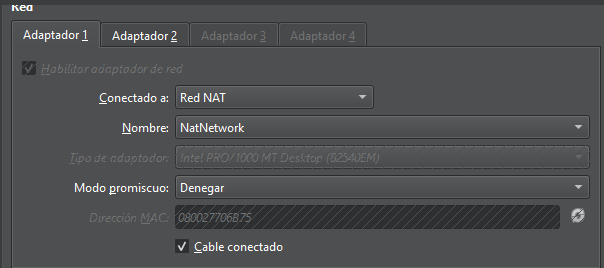

***

### 2) Xarxa: Adaptador Host‑Only (VirtualBox)

Afegirem un **Adaptador 2** en mode **Host‑Only** i li assignarem la interfície de VirtualBox per crear una xarxa local privada. Amb això el client i el servidor podran comunicar-se per una IP del rang 192.168.56.0/24 sense dependre d’Internet, ideal per fer proves de forma segura.

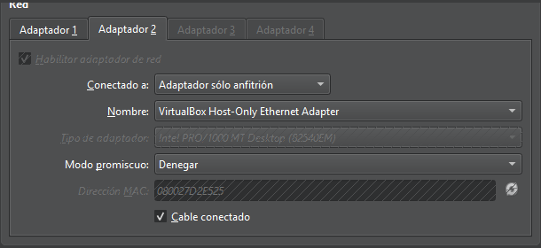

***

### 3) Actualitzar el sistema

Actualitzarem paquets i dependències perquè el sistema estigui al dia abans d’instal·lar vsftpd. D’aquesta manera reduirem errors, tindrem els darrers pegats de seguretat i una base estable sobre la qual treballar durant el laboratori.

```bash
sudo apt update && sudo apt upgrade -y
```

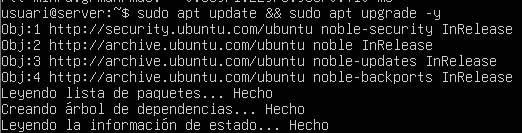

***

### 4) Instal·lar vsftpd

Instal·larem el servei **vsftpd** per disposar d’un servidor FTP lleuger i fiable. És una opció clàssica a Linux, senzilla de configurar i suficient per demostrar el funcionament del protocol i les proves de transferència que necessitem.

```bash
sudo apt install -y vsftpd
```

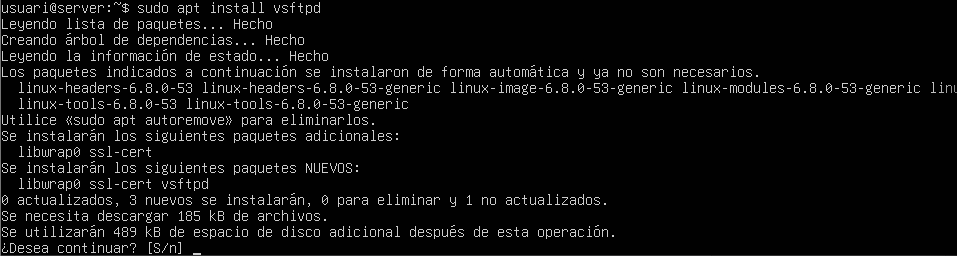

***

### 5) Còpia del fitxer de configuració

Farem una còpia de seguretat del fitxer principal de configuració abans de modificar-lo. Això ens permetrà tornar enrere de manera ràpida si alguna opció no funciona com esperàvem o volem desfer canvis sense complicacions.

```bash
sudo cp /etc/vsftpd.conf /etc/vsftpd.conf.bak
```


***

### 6) Carpeta pública per a FTP anònim

Crearem i prepararem **/srv/ftp** com a directori per defecte per a l’accés anònim en només lectura. Amb aquesta estructura, el servidor pot oferir descàrregues bàsiques de prova i nosaltres podem validar que el servei respon correctament.

```bash
sudo mkdir -p /srv/ftp
sudo chown root:root /srv/ftp
sudo chmod 755 /srv/ftp
```

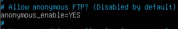

***

### 7) Configuració bàsica de vsftpd

Editarem la configuració per permetre accés **anònim**, habilitar **usuaris locals** i **confinar-los** (chroot) dins la seva carpeta, mantenint el laboratori controlat. Amb aquests ajustos podrem provar lectura/escriptura sense que els usuaris puguin sortir del seu espai.

    anonymous_enable=YES
    local_enable=YES
    write_enable=YES
    chroot_local_user=YES
    allow_writeable_chroot=YES

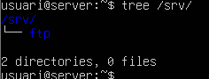

***

### 8) Reiniciar, habilitar i revisar el servei

Aplicarem els canvis reiniciant el servei, l’habilitarem a l’arrencada i en revisarem l’estat. Amb això comprovarem que la configuració és vàlida i que **vsftpd** està operatiu, llest per rebre connexions del client.

```bash
sudo systemctl restart vsftpd
sudo systemctl enable vsftpd
sudo systemctl status vsftpd --no-pager
```

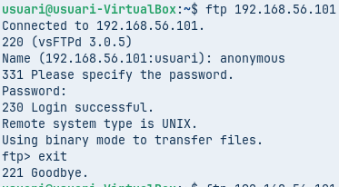

***

### 9) Tallafoc: obrir ports FTP

Afegirem regles al tallafoc per permetre el **port 21** (control) i el **rang passiu** de dades que farem servir. Així evitarem bloquejos en el llistat de directoris i en les transferències, especialment en mode passiu.

```bash
sudo ufw allow 21/tcp
sudo ufw allow 30000:31000/tcp
sudo ufw status
```

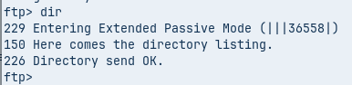

***

### 10) Prova bàsica amb el client `ftp`

Farem una prova de connexió des del client utilitzant la IP Host‑Only del servidor. Si el servei respon i podem iniciar sessió, ja tindrem validat el funcionament bàsic del servidor FTP sense necessitat de cap eina gràfica.

```bash
ftp 192.168.56.101
```

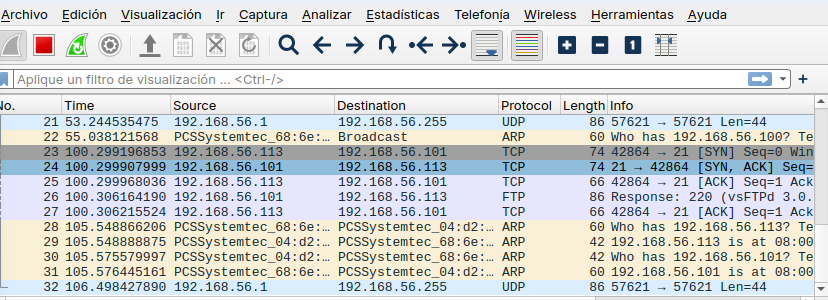

***

### 11) Connexió amb FileZilla (FTP sense xifrat)

Obrirem **FileZilla**, introduirem la IP del servidor i connectarem via FTP sense TLS per a l’Activitat A. Acceptarem l’avís d’inseguretat com a part de la pràctica, i comprovarem que la sessió s’estableix correctament amb el servidor.

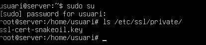

***

### 12) Llistat correcte del directori remot

Un cop dins, validarem que el **llistat de directoris** funciona i podem navegar pel contingut remot. Això confirma que el canal de dades s’obre correctament i que el tallafoc no està impedint les operacions bàsiques del protocol.

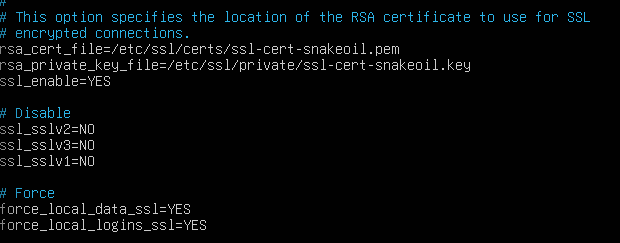

***

### 13) Wireshark: mode passiu (EPSV)

Capturarem el trànsit i observarem l’entrada al **mode passiu (EPSV)**, on el servidor anuncia un port i el client s’hi connecta. Aquesta prova ens ajuda a entendre el flux de control i dades i a identificar possibles problemes de xarxa.

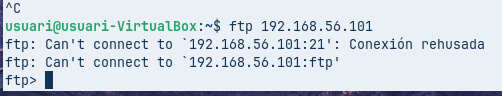

***

### 14) Definir rang passiu a vsftpd

Fixarem un **rang de ports** per al mode passiu a la configuració del servidor i reiniciarem el servei. Amb ports acotats, el tallafoc és més fàcil de gestionar i les proves es tornen més previsibles i repetibles.

    pasv_min_port=30000
    pasv_max_port=31000

```bash
sudo systemctl restart vsftpd
```

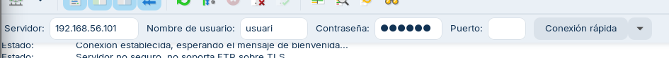

***

### 15) Usuari local amb “chroot”

Crearem un **usuari local** per provar autenticació i permisos, confirmant que queda **confinat** a la seva `/home`. Això reforça la seguretat del laboratori i evita l’accés a rutes del sistema que no pertoquen.

```bash
sudo adduser usuari
sudo systemctl restart vsftpd
```

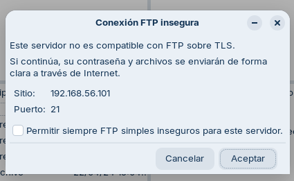

***

### 16) Demostració final amb FileZilla

Tancarem la pràctica mostrant la **connexió correcta** en FileZilla, el **llistat** del directori i, si cal, una **transferència** de fitxers. Aquesta captura serveix de prova final que el servidor està configurat i el client opera amb normalitat dins l’escenari plantejat.

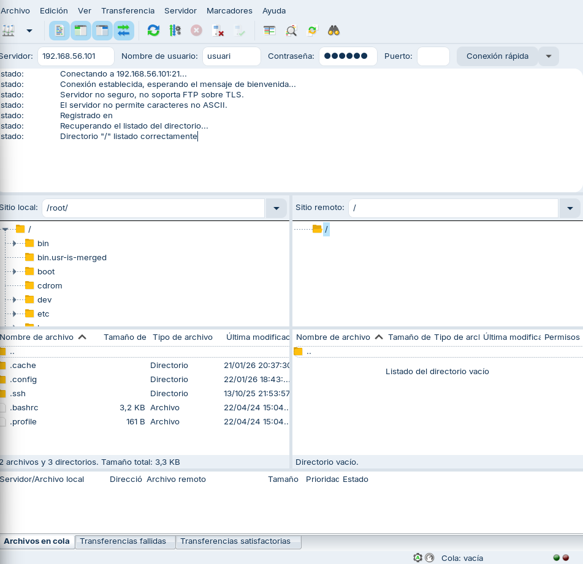
