# GUIA T03 ACTIVITAT B
### 1) Instal·lació del servei SFTP

Instal·larem el paquet **openssh-server** al servidor per habilitar el servei SFTP. Aquest pas és essencial perquè el sistema pugui acceptar connexions segures per transferència de fitxers.

```bash
sudo apt install openssh-server
```

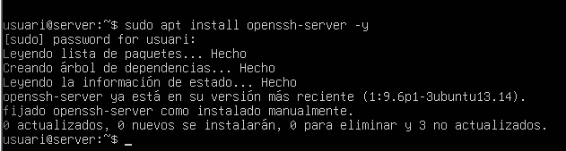

***

### 2) Prova de funcionament

Comprovarem que el servei funciona connectant-nos via SFTP des de la terminal amb l’usuari i la IP del servidor. També podem navegar per directoris per assegurar-nos que la connexió és correcta.

```bash
sftp usuari@192.168.56.101
cd /etc
pwd
```

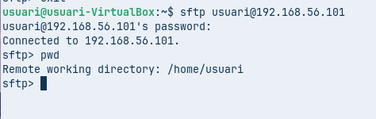
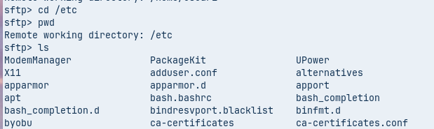

***

### 3) Configuració del servei

Editarem el fitxer **/etc/ssh/sshd\_config** per afegir les línies necessàries que permetin restringir l’accés i definir el comportament del servei SFTP. Això garanteix seguretat i control sobre els usuaris.

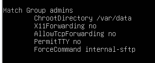

***

### 4) Creació d’usuari i grup

Crearem un grup anomenat **admins** i un usuari **admin1** que pertanyi a aquest grup. Assignarem una contrasenya per poder autenticar-nos.

```bash
sudo addgroup admins
sudo useradd -G admins admin1
sudo passwd admin1
```

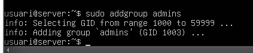
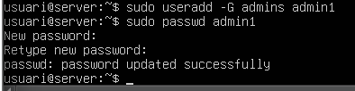

***

### 5) Carpetes i permisos
Primer farem un:
```bash
ls -l /var
```
Per veure les caracteristiques de les carpetes existens.

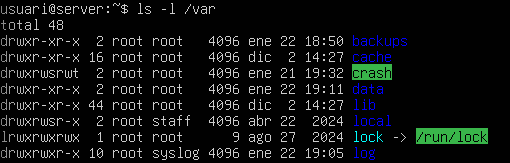

Crearem una carpeta arrel **/var/data** i dins d’ella una subcarpeta **files** on els membres del grup **admins** puguin llegir i escriure. Configurarem propietaris i permisos adequats per garantir seguretat i funcionalitat.

```bash
sudo mkdir /var/data
sudo mkdir /var/data/files
sudo chown :admins /var/data/files/
sudo chmod 2770 /var/data/files/
```

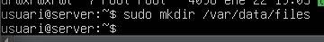
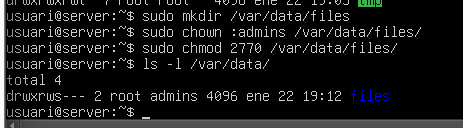

***

### 6) Comprovacions finals

Verificarem que l’usuari **admin1** no pot accedir per SSH, però sí per SFTP. Això confirma que la configuració és correcta i que el servei funciona segons els requisits establerts.

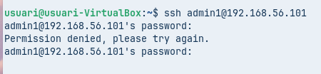
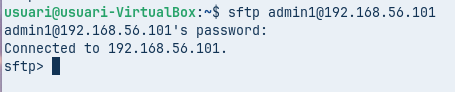

***

