# Guia T06

### Obrir Active Directory Administrative Center.

Primer de tot anirem a la opció de Tools dintre del Server Manager, i en allà a la opció de Active Directory Administrative Center.  
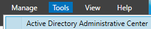

Després anirem a la opció on surt el nostre domini, en allà seleccionarem la carpeta de Builtin i a Enable Recycle Bin.  
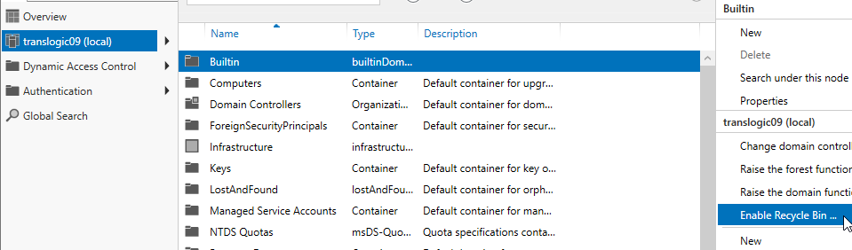

S'ens haurà creat una carpeta que diu Deleted Objects.  
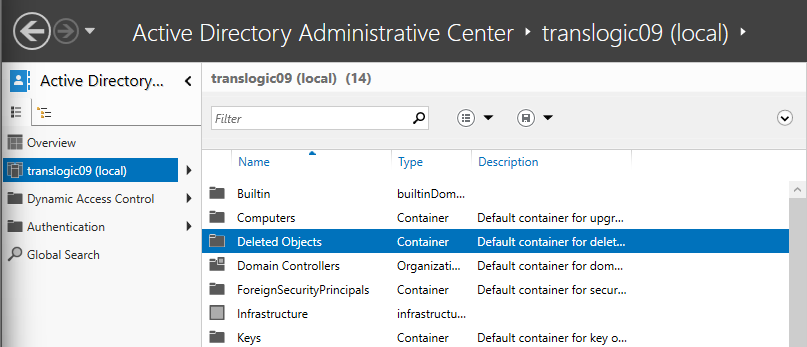

### Obrir AD DS i crear la OU.

Ara anirem a la opció de AD DS i en allà elegirem Active Directory Users and Computers.  
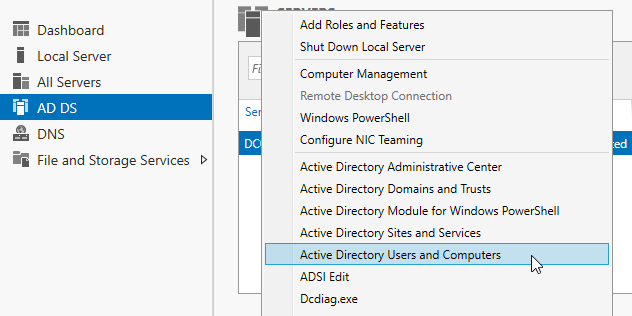

Una vegada dins, farem doble clic sobre el nostre domini i se'ns obrirà una finestra. En allà, on posa Name, posarem BCN.  
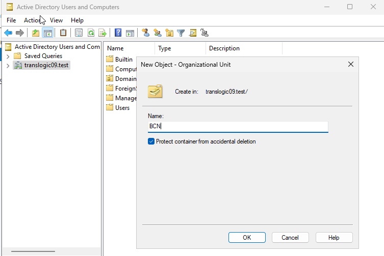

### Crear els grups.

Ara farem clic dret a Users, New i Group.  
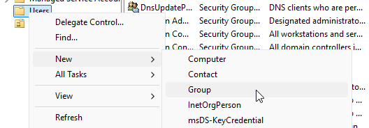

Se'ns obrirà una finestra i crearem els grups amb els noms que ens han dit.  
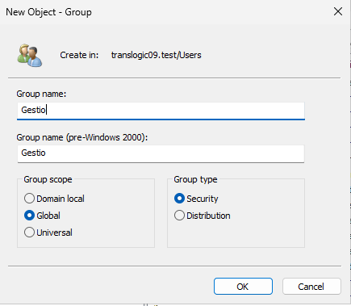

Una vegada creats tots, ens sortirà així.  
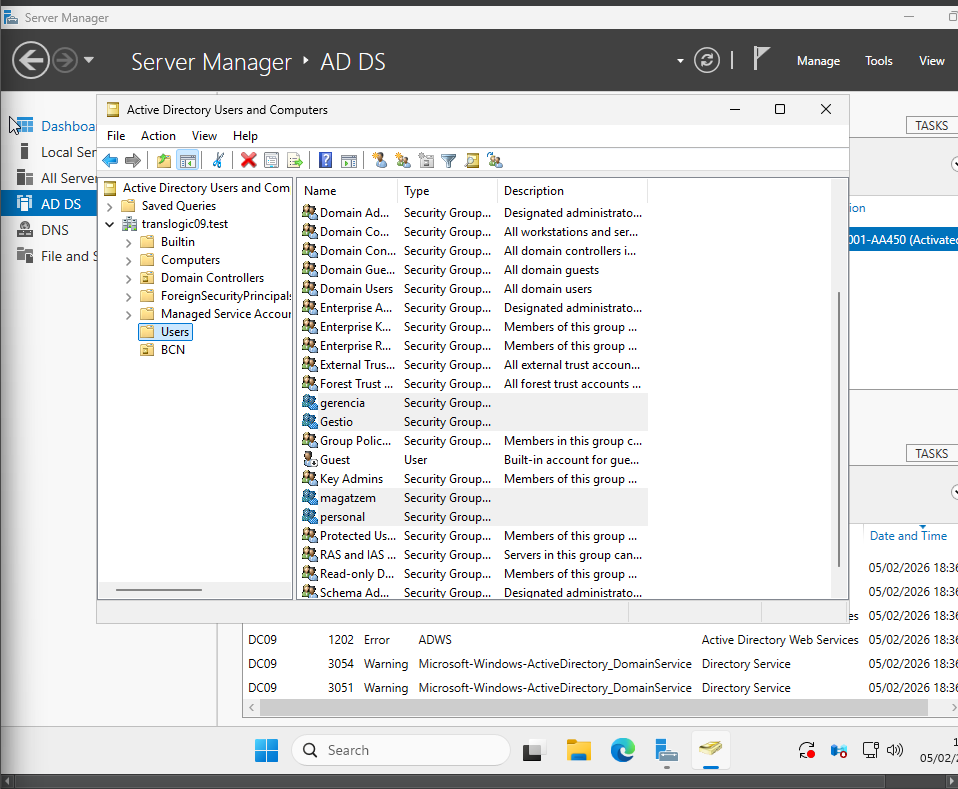

### Afegir els grups a “personal”.

Ara entrarem dintre de personal i afegirem els tres altres grups creats.  
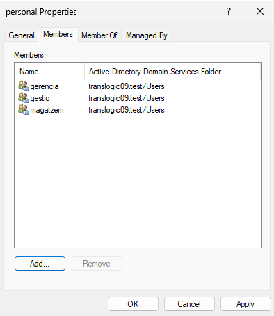

### Afegir i preparar el disc de 5GB.

Ara afegirem un disc de 5 GB a la màquina virtual amb SATA 2.  
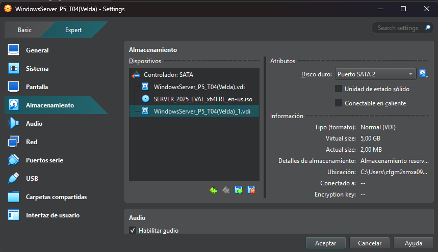

Ara inicialitzarem el disc dur amb l'administrador de discos.  
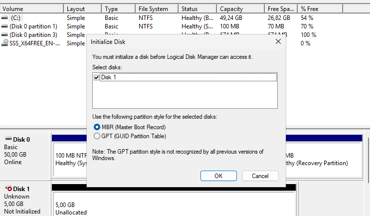

Li posarem de nom DATA i ens ha de sortir així.  
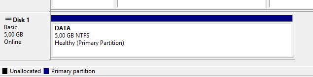

Ara tindrem una carpeta en aquest disc dur que es diu personal.  
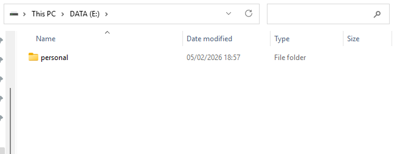

### Configurar permisos.

Ara anirem a les propietats de Sharing, en allà anirem a Permissions i li donarem Full Control.  
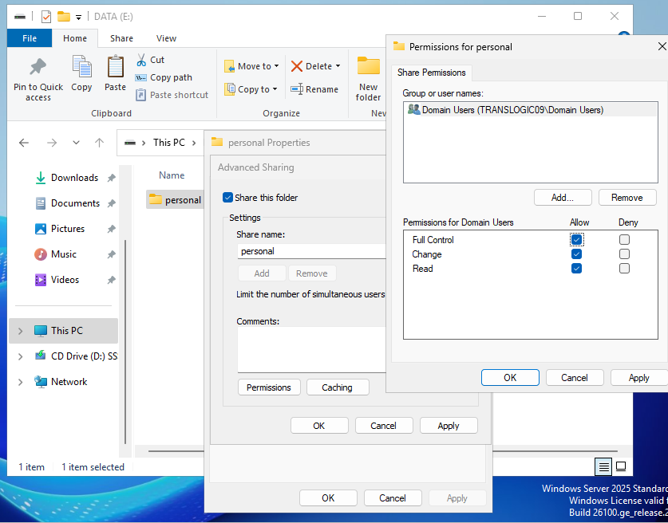

Ara anirem a la configuració avançada de seguretat i ens sortirà això.  
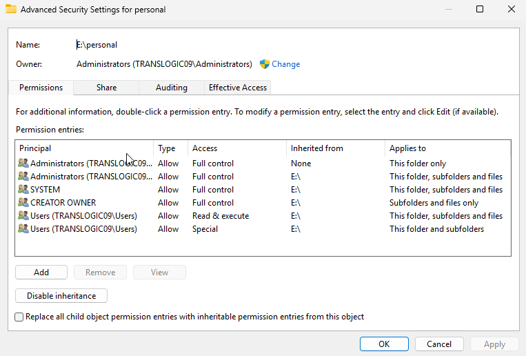

Ara posarem les configuracions d’aquestes fotos.  
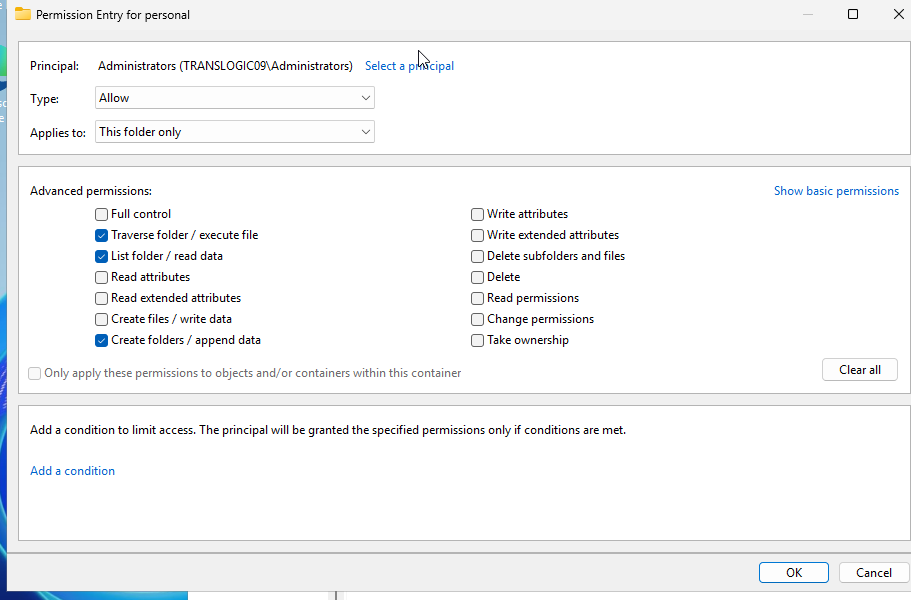 
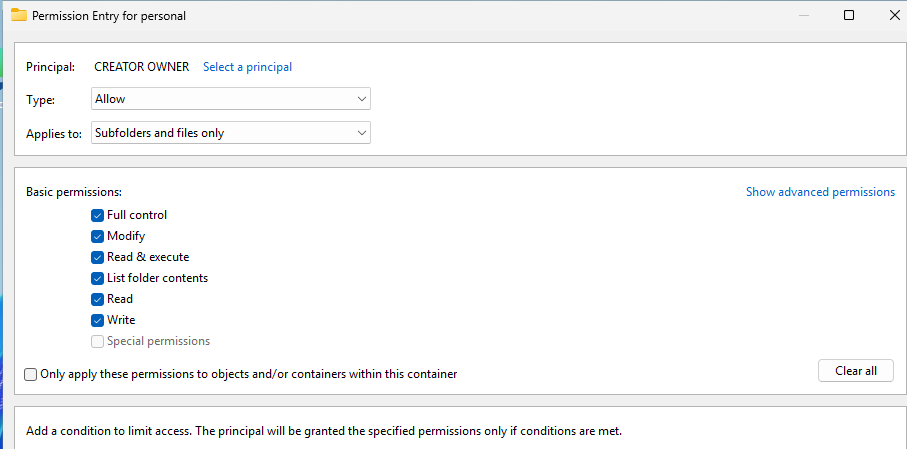

I ens quedarà així.  
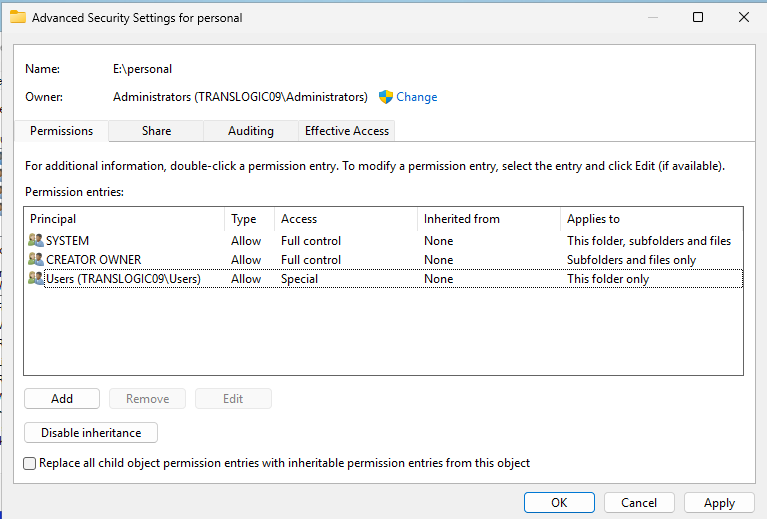

