# ACTIVITATS T08
### 1. Desactivació d'antimalware
Primer desactivem el firewall, la protecció en temps real i la protecció de xarxa de Microsoft Edge.

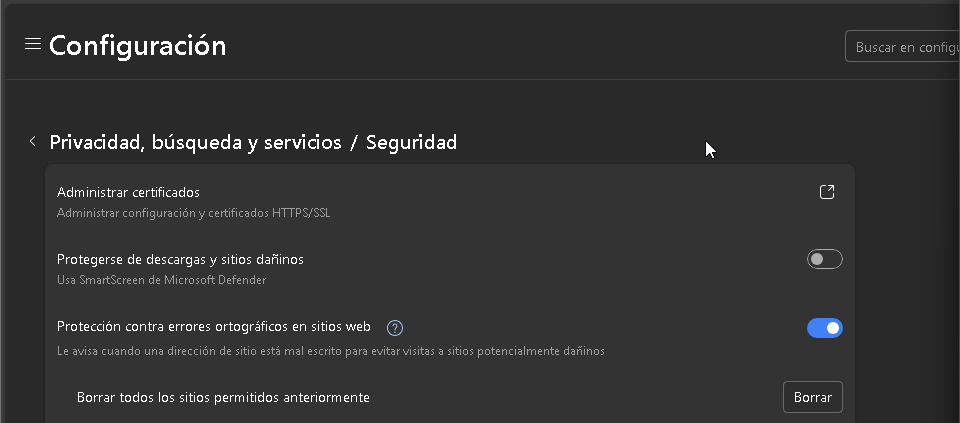
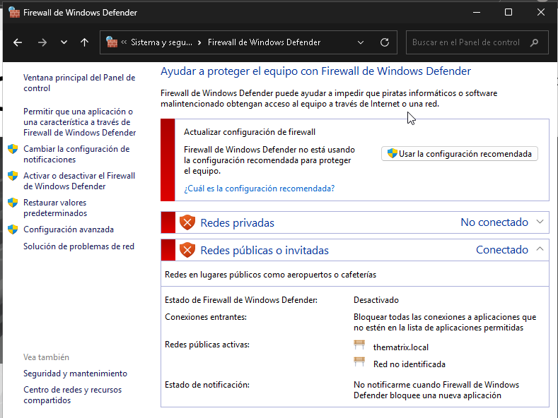
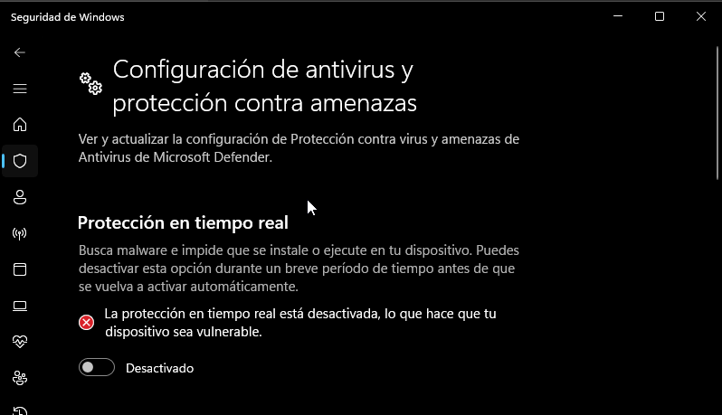

Després anem a la web https://www.eicar.org per descarregar el fitxer de prova EICAR. Normalment, amb la protecció activada no ens deixaria baixar-lo.

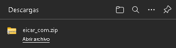

Com que hem desactivat la protecció, ara sí que el podrem descarregar.

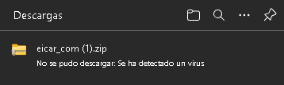

### 2. Zip,Tar i 7zip
Ara probarem a instalar-ho amb zip tar i 7zip per veure si el antimalware ens ho impedeix o no.

Amb zip ja hem vist que no ens deixa

Amb Tar em de agafar 

PER FER PER FERPER FERPER FERPER FERPER FERPER FERPER FERPER FERPER FERPER FERPER FERPER FERPER FERPER FERPER FERPER FERPER FERPER FERPER FERPER FERPER FERPER FERPER FERPER FERPER FERPER FERPER FERPER FER
PER FER PER FERPER FERPER FERPER FERPER FERPER FERPER FERPER FERPER FERPER FERPER FERPER FERPER FERPER FERPER FERPER FERPER FERPER FERPER FERPER FERPER FERPER FERPER FERPER FERPER FERPER FERPER FERPER FER
PER FER PER FERPER FERPER FERPER FERPER FERPER FERPER FERPER FERPER FERPER FERPER FERPER FERPER FERPER FERPER FERPER FERPER FERPER FERPER FERPER FERPER FERPER FERPER FERPER FERPER FERPER FERPER FERPER FER
PER FER PER FERPER FERPER FERPER FERPER FERPER FERPER FERPER FERPER FERPER FERPER FERPER FERPER FERPER FERPER FERPER FERPER FERPER FERPER FERPER FERPER FERPER FERPER FERPER FERPER FERPER FERPER FERPER FER
PER FER PER FERPER FERPER FERPER FERPER FERPER FERPER FERPER FERPER FERPER FERPER FERPER FERPER FERPER FERPER FERPER FERPER FERPER FERPER FERPER FERPER FERPER FERPER FERPER FERPER FERPER FERPER FERPER FER
PER FER PER FERPER FERPER FERPER FERPER FERPER FERPER FERPER FERPER FERPER FERPER FERPER FERPER FERPER FERPER FERPER FERPER FERPER FERPER FERPER FERPER FERPER FERPER FERPER FERPER FERPER FERPER FERPER FER
PER FER PER FERPER FERPER FERPER FERPER FERPER FERPER FERPER FERPER FERPER FERPER FERPER FERPER FERPER FERPER FERPER FERPER FERPER FERPER FERPER FERPER FERPER FERPER FERPER FERPER FERPER FERPER FERPER FER

### 3.Sistemes protecció Windows 11
1. Quines proteccions incorporar Windows 11 a la seccció de "Protección antivirus y contra amenazas"?
- **Amenaçes actuals per fer un examen de malwares**

Mostra els virus, troians i altres malwares detectats recentment al sistema.
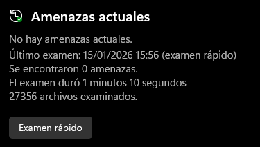

- **Configuració de antivirus i protecció contra amenaçes**

Permet ajustar com el Windows Defender escaneja i protegeix l’ordinador.
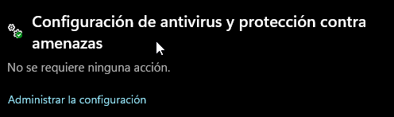

- **Actualitzacions de protecció contra virus i amenaçes**

Manté el programari antivirus al dia amb les últimes definicions de virus.
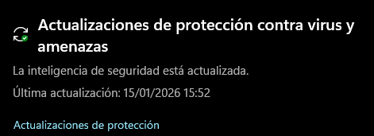

- **Protecció contra ransomware**

Evita que programes maliciosos xifrin fitxers importants i permet protegir carpetes específiques.
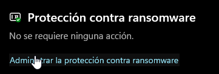

2. Quines opcions tenim a "Control de aplicaciones y navegador"?
- **Control intel·ligent d’aplicacions**

Permet decidir quines aplicacions poden executar-se i accedir a recursos del sistema.
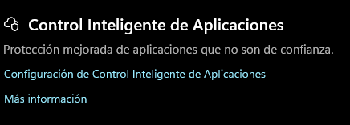

- **Protecció basada en reputació**

Avalua aplicacions i fitxers segons la seva reputació en línia per bloquejar possibles amenaces.
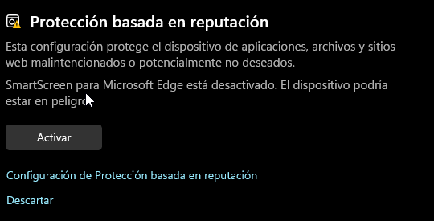

3. Investigueu quines opcions específiques hi ha per la protecció contra ransomware a Windows 11.

- **Control d’accés a la carpeta**

Protegeix les carpetes importants contra modificacions no autoritzades.
Només les aplicacions aprovades poden afegir, eliminar o canviar fitxers dins d’aquestes carpetes.
Això ajuda a evitar que programes maliciosos o ransomware afectin les teves dades.

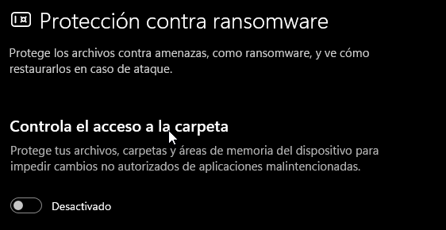

### 4.Prova pràctica de protecció contra Ransomware
1. Afegiu dins la carpeta "Documents" uns quants arxius TXT.
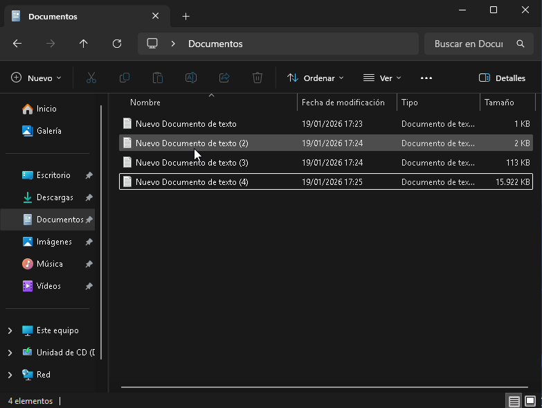

2. Desactiveu, si està activada prèviament, la protecció contra ransomware.
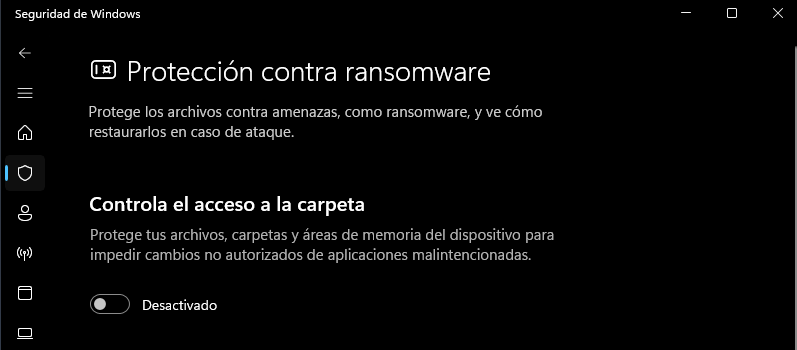

3. Descarregeu el fitxer de prova de ransomware de https://github.com/JoelGMSec/PSRansom. Es tracta d'un script de PowerShell que simula el comportament d'un ransomware. Com per defecte, Windows 11 restringeix l'execució d'scripts de PowerShell, haureu de canviar la política d'execució per permetre-ho, obrint una finestra de PowerShell com a administrador i executant la següent ordre:
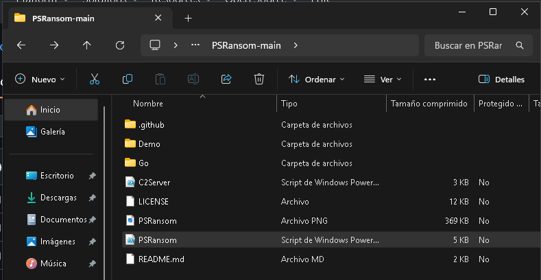
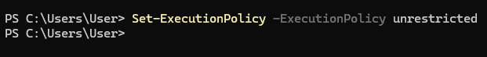

4. Obre una consola de PoweShell a la carpeta on hagis descarregat l'script i executa'l amb la següent ordre:
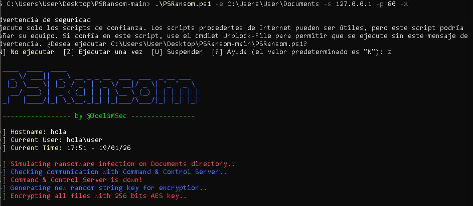

5. Comproveu com el contingut de la carpeta "Documents" ha estat xifrat. Veieu com s'ha creat un arxiu anomenat "READ_ME.txt" que incloula clau clau de recuperació.
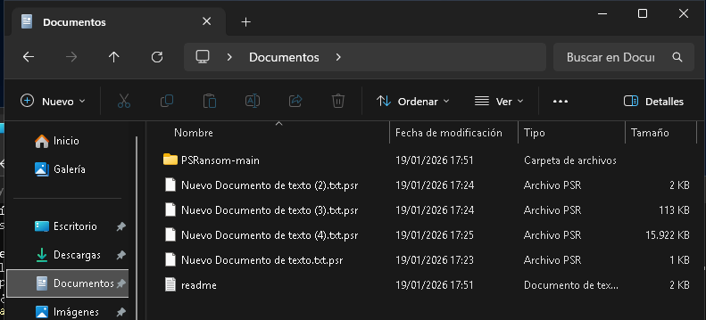

6. Com és un ransomware de prova, ens permet desxifrar els fitxers. Torneu a obrir PowerShell i executeu l'script amb la següent ordre per desxifrar els fitxers:
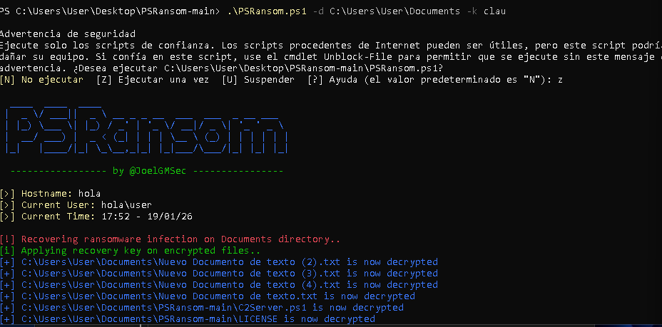

7. Ara, activeu la protecció contra ransomware. Comproveu que la carpeta "Documents" està protegida i torneu a executar l'script.
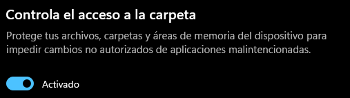

8. Comproveu que els fitxers de la carpeta "Documents" NO han estat xifrats. Observa l'alerta que es genera a l'antimalware.
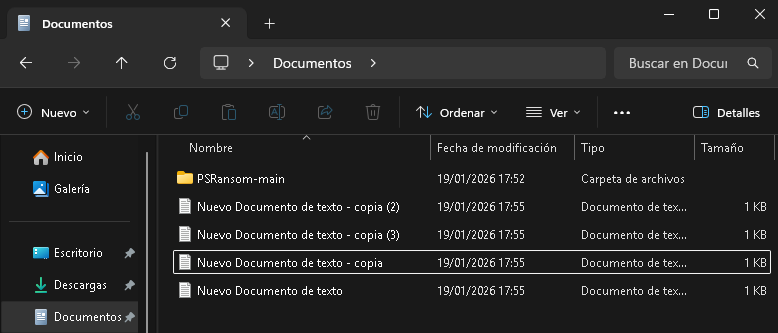

### 5.Atacs de Ransomware: WannaCry
Llegiu la informació sobre WannaCry https://www.avg.com/es/signal/wannacry-ransomware-what-you-need-to-know i busqueu informació als enllaços dels projectes antiransomware per contestar les preguntes següents:

1. Expliqueu quins són els factors que fan que WannaCry es propagui tan ràpid. Expliqueu què vol dir.

2. Quina vulnerabilitat en concret es fa servir? Busqueu el CVE associat. És molt greu?

3. S'ha de pagar el rescat demanat? Per què? Busqueu per internet a veure si trobeu alguna empresa negociadora de rescats i com funciona. Això s'està fent, tot i que no se sol recomanar...

4. Quines mesures podem aplicar si volem PREVENIR un atac de Ransomware abans que passi?

5. Quines mesures aplicarem si JA HEM SOFERT un atac de WannaCry i no hem aplicat les mesures de prevenció o ho hem fet parcialment?