# Guia T09
### Configuració de la màquina
En la màquina d’OpenVAS configurarem l’Adaptador 1 en mode NAT perquè tingui sortida a Internet i pugui actualitzar-se i descarregar tot el necessari, i afegirem un Adaptador 2 en mode Només amfitrió (Host‑Only).
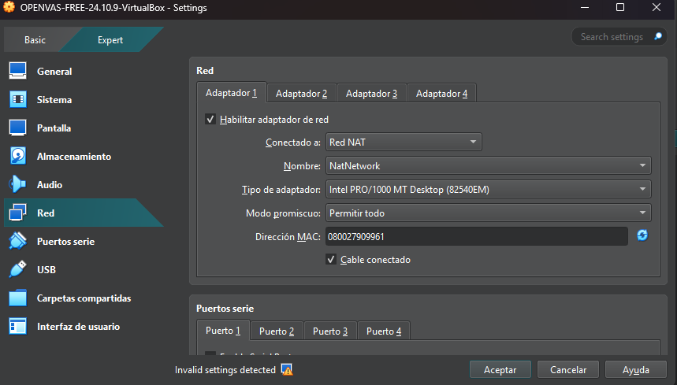
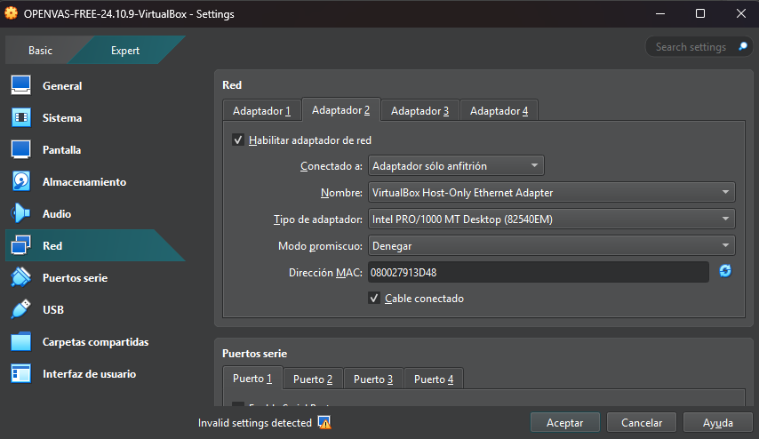

En la màquina Metasploitable configurarem l’únic adaptador de xarxa en mode NAT.
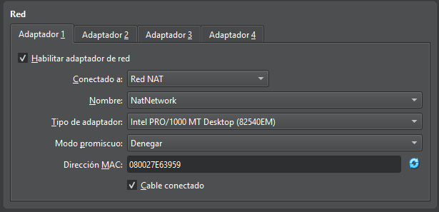

---
### Metasploitable
Per començar iniciarem la màquina Metasploitable des del nostre hypervisor i esperarem que arrenqui completament. Quan aparegui la pantalla de login, iniciarem sessió amb l’usuari msfadmin i la contrasenya msfadmin, que són les credencials predeterminades del sistema.
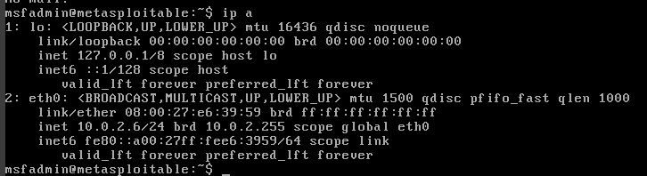
---

### Instal.lació OpenVas
Al instal·lar OpenVAS ens demanarà quin usuari i contrasenya volem posar; li posarem com a usuari Admin i com a contrasenya també Admin.

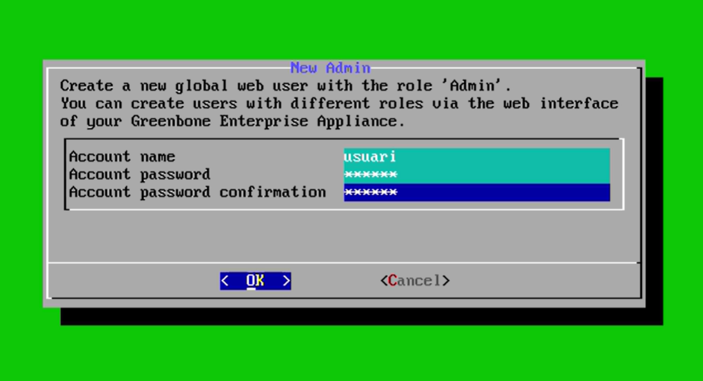

Després sortirà una finestra que diu “Upload subscription key now” i li donarem a Skip per continuar sense posar cap clau.

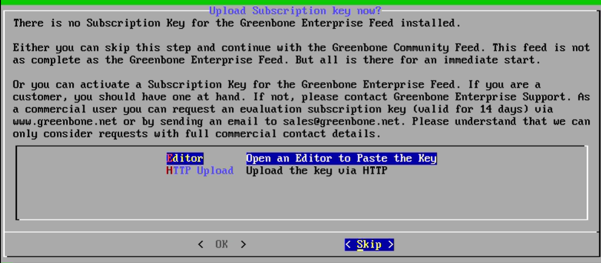

Per últim apareixerà una finestra del selfcheck i simplement li donarem a Continue perquè faci les comprovacions automàtiques i acabi de preparar OpenVAS per poder començar a utilitzar-lo.

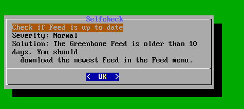

### Configuració de OpenVas
Volem configurar les interfícies de xarxa, així que anirem al menú OS administration i li donarem a l’opció Setup.

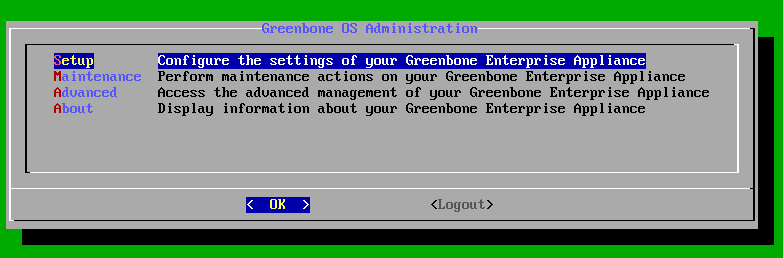

Un cop dins de Setup Menu, seleccionarem l’opció Network. Aquí és on trobarem totes les opcions relacionades amb la configuració de la xarxa.

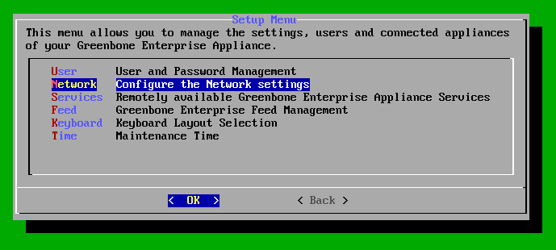

Dins del menú de Network, triarem l’opció Interfaces. Des d’aquest apartat podrem veure i editar les diferents targetes de xarxa de la màquina

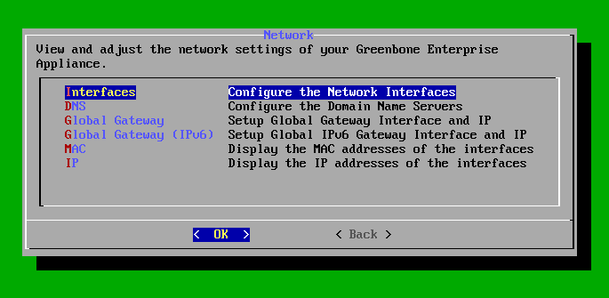

Ara configurarem els dos adaptadors de xarxa i en tots dos activarem el DHCP perquè agafin la IP automàticament; així no haurem de posar la IP a mà i només caldrà guardar els canvis perquè la configuració quedi aplicada correctament.

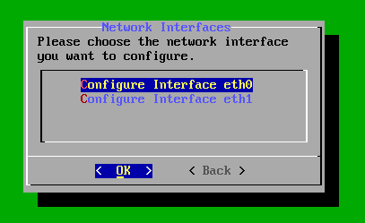
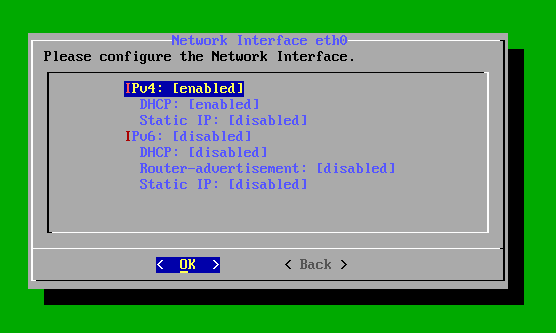
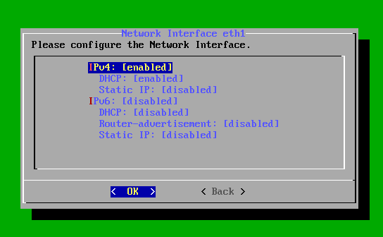

### WEB
Ara mirarem la IP que té la màquina; obrirem el terminal i mostrarem la configuració de xarxa per saber quina adreça IP haurem de posar després al navegador per entrar a la web d’OpenVAS.
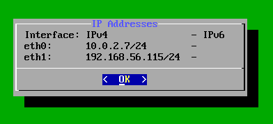

Un cop sapiguem la IP, la posarem a la barra del navegador (per exemple http://IP) i se’ns obrirà la pàgina web d’OpenVAS, des d’on podrem fer tota la configuració i els escanejos.
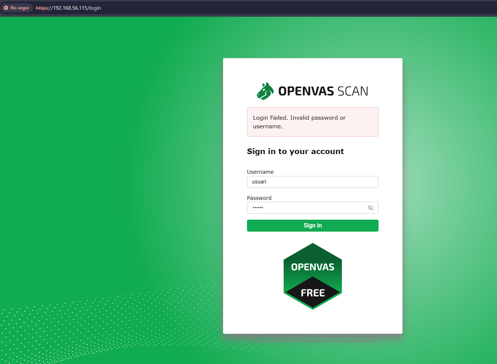

Quan entrem a la web, seleccionarem un dashboard i el deixarem tal qual ve per defecte, sense canviar res més, per poder continuar ràpidament amb la configuració.
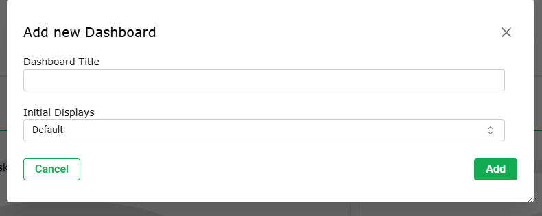

Ara afegirem un host nou i li posarem la IP de la màquina Metasploitable, ja que serà la màquina que volem escanejar, i a la descripció hi escriurem linux per identificar fàcilment el sistema.
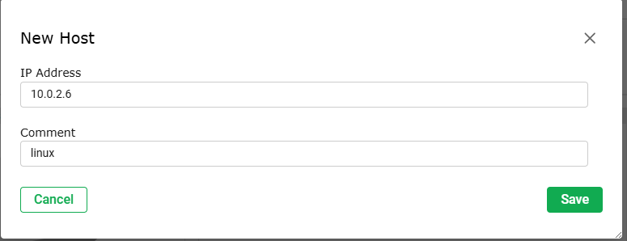

Ara crearem una targeta, li canviarem el nom a vulnerable Linux i en l’apartat de Hosts li posarem l’opció From hosts assets.
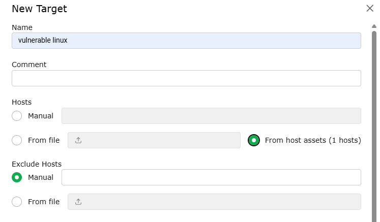

Per poder continuar crearem una credencial de SSH; no tocarem cap altra opció, només li posarem un usuari i una contrasenya.
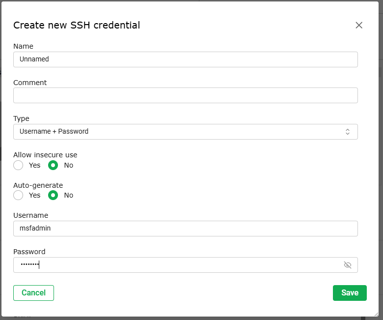

Ara aquesta credencial de SSH la assignarem a la targeta que estàvem creant abans.
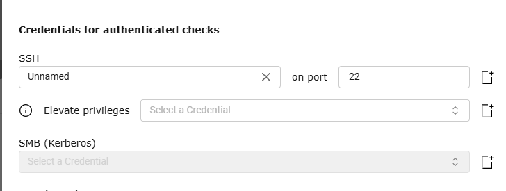

Una vegada acabada la targeta, anirem a crear una tasca, li posarem un nom i li direm que escanegi la màquina que vulguem, en el meu cas la de vulnerable Linux.
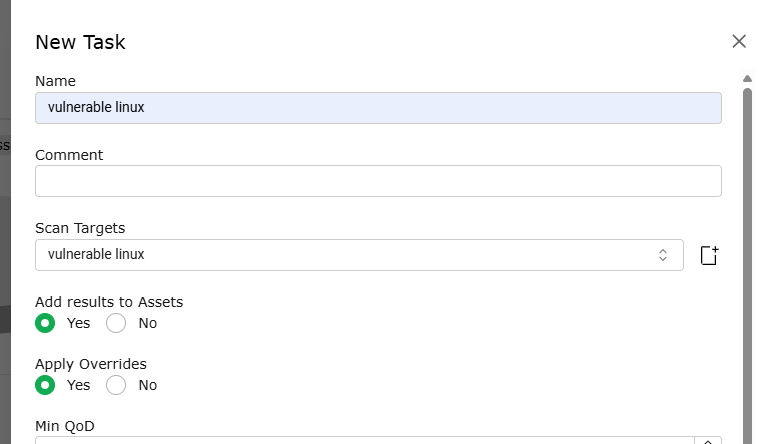

Ara li donarem a iniciar la tasca i esperarem que arribi al 100%, mirant la barra de progrés fins que acabi l’escaneig.
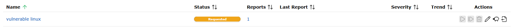
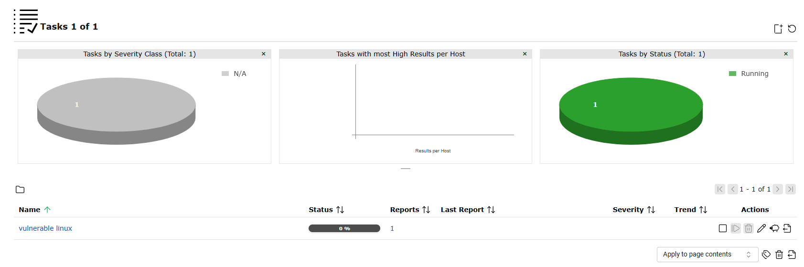

Un cop acabi la tasca veurem el resultat de l’escaneig i podrem revisar amb més detall tota la informació i les vulnerabilitats que ha trobat.
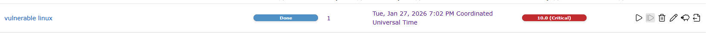
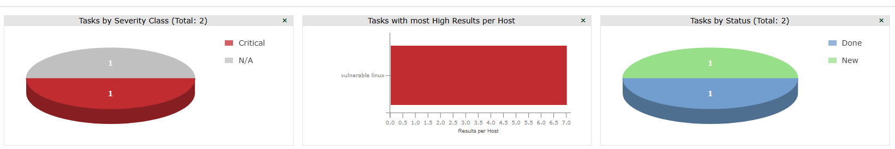

### RESULTATS
En aquest apartat veurem un resum general de l’escaneig, amb informació bàsica sobre la tasca, l’estat i una visió ràpida del que s’ha trobat.
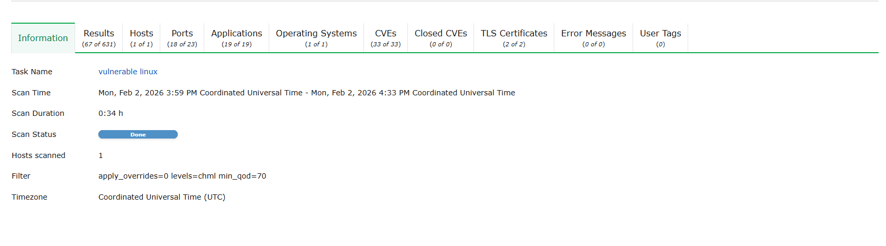

Aquí es mostren tots els resultats de l’escaneig, és a dir, les vulnerabilitats i avisos que OpenVAS ha detectat a la màquina.

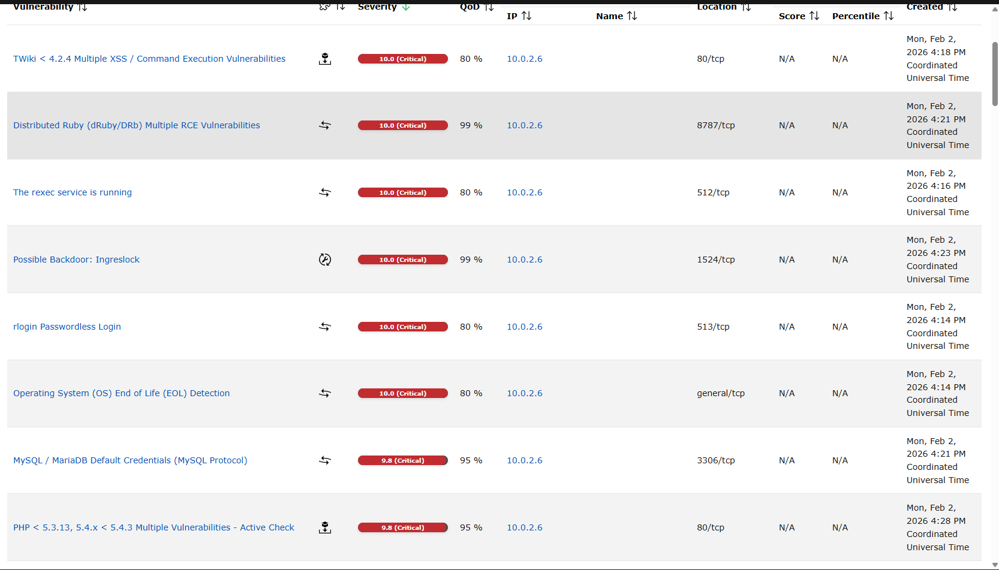

En aquest apartat apareixen els hosts que s’han escanejat, amb la seva IP i dades bàsiques de cada màquina analitzada.

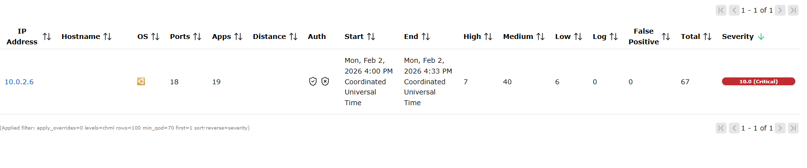

Aquí veurem els ports que s’han trobat oberts en els hosts escanejats, juntament amb el seu estat i el servei que hi està escoltant.

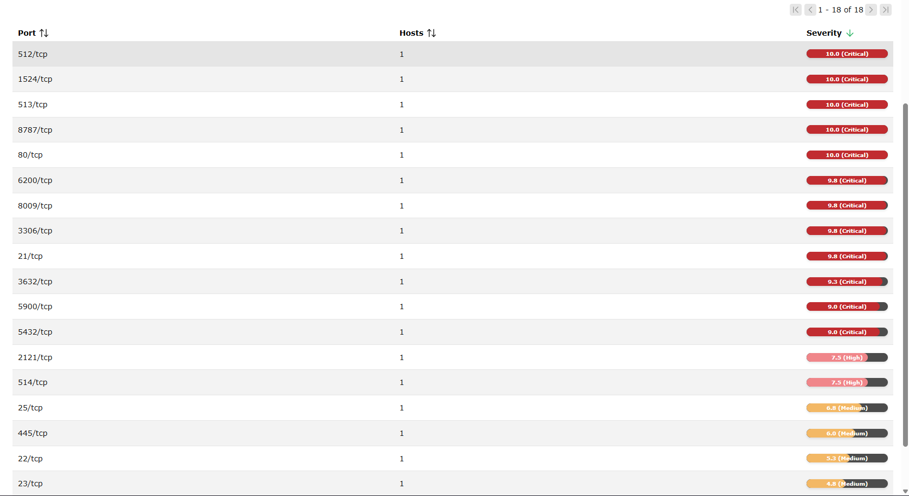

En aquest apartat es mostren les aplicacions o serveis detectats als ports oberts, com ara servidors web, SSH o bases de dades.

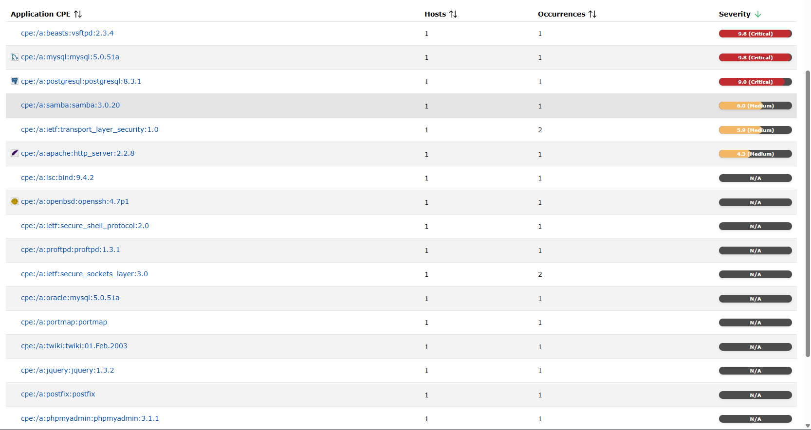

Aquí OpenVAS intenta identificar el sistema operatiu de cada host, mostrant si és Linux, Windows o un altre tipus de sistema.
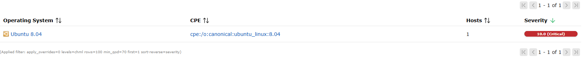

En aquest apartat es llisten les vulnerabilitats relacionades amb CVEs, amb els identificadors oficials perquè es puguin consultar més detalls.

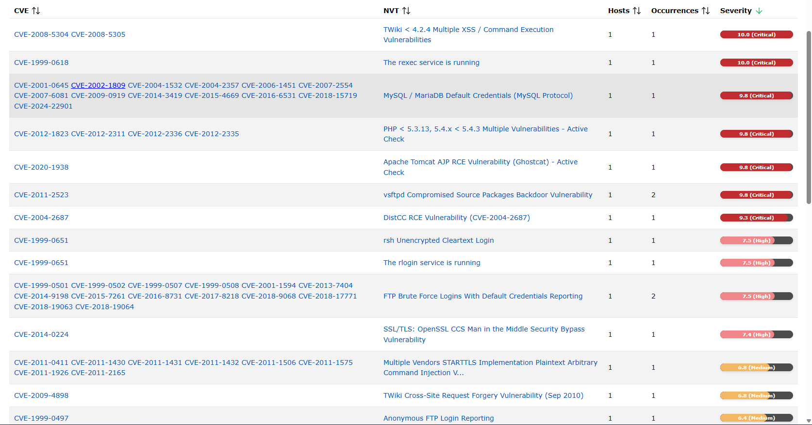

Aquí es mostren els certificats TLS detectats als serveis segurs, amb informació sobre la seva validesa i possibles problemes de seguretat.
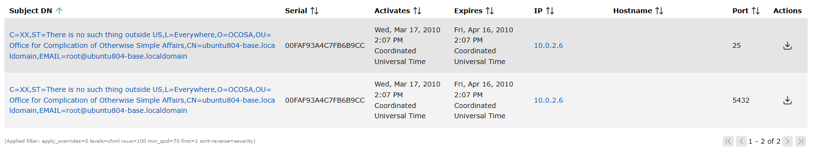

### Vulnerabilitats trobades

Aquesta vulnerabilitat indica que al port 1524/tcp hi ha un possible backdoor anomenat Ingreslock.
Un backdoor és una “porta del darrere” que permet entrar al sistema sense permís.
Si algú l’aprofita, podria executar ordres i controlar tota la màquina.
Per això té una severitat 10.0 (Crítica) i s’ha d’aturar o tancar aquest servei de seguida.

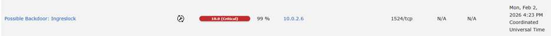

Aquesta vulnerabilitat és d’una versió antiga de TWiki que es veu pel port 80/tcp.  
Permet que algú entri a la web i hi posi codi maliciós (XSS) o fins i tot executi ordres al servidor.  
Si s’aprofita, l’atacant podria arribar a controlar la pàgina i el sistema on està instal·lat.  
Per arreglar-ho, cal actualitzar TWiki a una versió nova i protegir bé l’accés a la web.

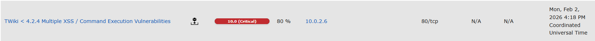

Aquesta vulnerabilitat afecta Distributed Ruby (dRuby/DRb), que escolta al port 8787/tcp.
Permet que un atacant enviï codi Ruby al servei i que aquest codi s’executi directament al servidor (execució remota de codi).
Això pot donar control gairebé total de la màquina a l’atacant.
Per reduir el risc, s’hauria de desactivar aquest servei, limitar-ne l’accés o actualitzar-lo/corregir-lo.

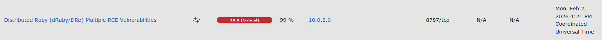

Aquesta vulnerabilitat indica que el servei rexec està funcionant al servidor.
rexec és un servei antic que permet executar ordres remotament i sol enviar usuari i contrasenya sense xifrar.
Un atacant podria espiar aquestes dades o arribar a executar ordres a la màquina.
El més recomanable és desactivar el servei rexec i no utilitzar-lo.

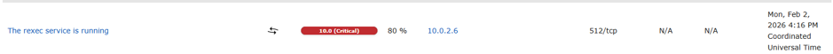